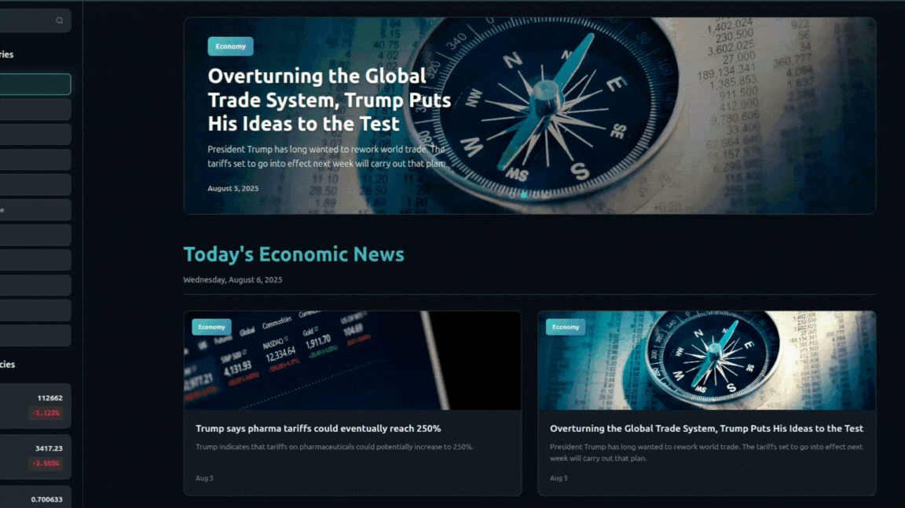
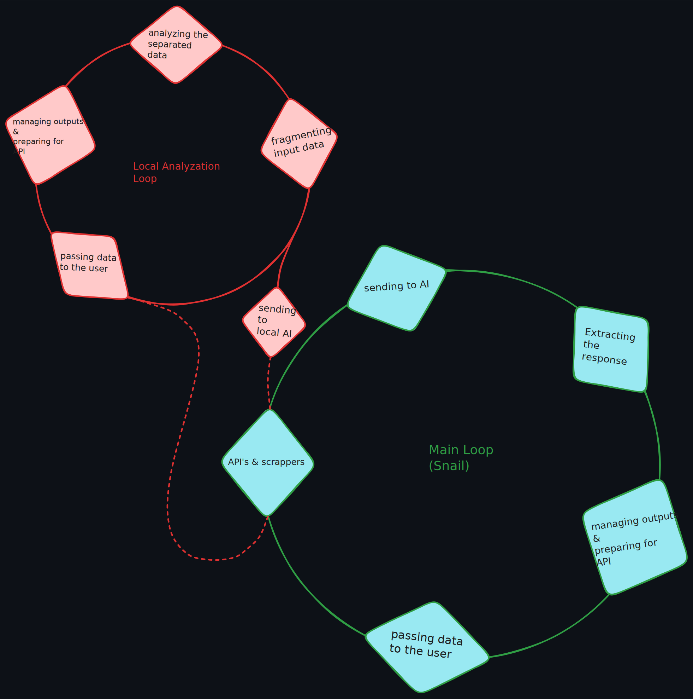

<h1 align="center">
  <br>
  <a href="#"></a>
  <br>
  Ecovision
  <br>
</h1>

<h4 align="center">An AI-Powered Full-Stack Platform for Economic News Analysis.</h4>


<p align="center">
  
  
  
  

</p>

<p align="center">
  <a href="#🌟-key-features">Key Features</a> •
  <a href="#🚀-how-to-use">How To Use</a> •
  <a href="#⚖️-license">License</a> •
  <a href="#👥-contributors">Contributors</a>
</p>

<p align="center">
  
</p>


## 🌟 Key Features

Ecovision offers a robust set of features designed to provide comprehensive economic insights powered by artificial intelligence.

### 📊 **Powerful Data Analysis**
* **Real-time Analytics**: Instant processing of market and cryptocurrency data to provide predictive insights and help you stay ahead of trends.
* **Advanced Algorithms**: Comprehensive analysis of complex datasets, enabling the detection of subtle patterns and critical anomalies.

### 🔗 **API-Driven Architecture**
* **Wide Range of APIs**: Supports seamless integration with finance, markets, investing, technology, and science APIs, making it easy for both developers and users to connect.
* **Admin Controls**: A dedicated admin panel provides intuitive controls for API and system management, allowing for easy toggling and running of various processes.

### 🌐 **Stay Updated with Market Trends**
* **Cryptocurrency Insights**: Get real-time updates on major cryptocurrencies like Bitcoin, Ethereum, Cardano, and more, complete with visual indicators for price changes and market trends.
* **Featured News**: Access aggregated news feeds to keep you informed about the latest economic developments and global events.

### 💡 **User-Friendly Design**
* **Interactive Dashboard**: Features accessible buttons for quick actions such as fetching news or viewing logs, simplifying navigation for both administrators and general users.
* **Customizable Inputs**: Easily set parameters for specific tasks like data scraping or fetching, giving you control over the information you receive.

### 🚀 **Technological Innovation**
* **Modular Design**: Built with scalability in mind, Ecovision's modular architecture is adaptable for future enhancements and encourages open-source collaboration and creativity.
* **Automated Processes**: Enjoy seamless integration of scrapers and data handlers, along with automated logging and status tracking for enhanced reliability.

### 📈 **Empowering Decision-Making**
* **Market Predictions**: Analyzes historical data to generate smarter investment strategies, helping users make informed decisions with confidence.
* **Transparency**: Provides open access to logs and system status, ensuring better oversight and understanding of the platform's operations.


## 🚀 How To Use

Ready to get Ecovision up and running? Follow these steps to set up your development environment and launch the platform.

### **Prerequisites**

Before you begin, ensure you have the following software installed on your system:

* **Git**: Essential for cloning the project repository.
* **Python**: Make sure you have Python installed, along with its package installer, **Pip**.
* **Node.js**: Install Node.js, which includes **npm** (Node Package Manager) for managing frontend dependencies.

### **Installation**

Let's get the project files onto your machine and install the necessary dependencies for both the backend and frontend.

1.  **Clone the Repository:**
    Start by cloning the Ecovision project from its GitHub repository:

    ```bash
    git clone [https://github.com/alirezaArz/Ecovision.git](https://github.com/alirezaArz/Ecovision.git)
    ```

2.  **Navigate to the Project Root:**
    Change your current directory to the newly cloned project's main folder:

    ```bash
    cd Ecovision
    ```

3.  **Install Backend Dependencies:**
    Install all required Python packages for the Django backend using `pip`:

    ```bash
    pip install -r requirements.txt
    ```

4.  **Install Frontend Dependencies:**
    Move into the `frontend` directory and install the React application's dependencies using `npm`:

    ```bash
    cd frontend
    npm install
    ```

## **Get Gemini Developer Key**

To enable features that utilize Google's Gemini API, you'll need to obtain a developer API key and configure it within your project.

### 1. **Obtain Your API Key**

* Go to the **Google AI for Developers** page: [https://ai.google.dev/gemini-api/docs/api-key](https://ai.google.dev/gemini-api/docs/api-key)
* Follow the instructions on the page to create an account (if you don't have one) and generate your API key.

### 2. **Configure `gmkey.json`**

Once you have your API key, you'll store it in a dedicated configuration file within the project structure:

1.  **Create the `gmkey.json` file:**
    Create a new file named `gmkey.json` inside the `services/External_AI_Models` directory.

2.  **Copy and paste the following code into `gmkey.json`:**
    ```json
    {
        "key": "your_api_key_here"
    }
    ```

3.  **Paste your API Key:**
    Replace `"your_api_key_here"` with the actual API key you obtained from the Google AI for Developers page.

By following these steps, Ecovision will be able to authenticate and interact with the Gemini API for external AI functionalities.

## **Setting Up Ollama LLM (2 Billion+ Parameters)**

if you want to use local AI capabilities within Ecovision, you'll need to install Ollama and configure a Large Language Model (LLM) with at least 2 billion parameters.

### 1. **Install Ollama**

Ollama is a powerful tool for running LLMs locally on your machine. If you haven't installed it yet, follow these steps:

* Visit the **official Ollama website**: [https://ollama.com/](https://ollama.com/)
* Download and install the appropriate version for your operating system (Windows, macOS, Linux). Comprehensive installation instructions are available on the Ollama website.

### 2. **Choose and Download an LLM (2B+ Parameters)**

Once Ollama is installed, you'll need to download an LLM with at least 2 billion parameters. Ollama provides a library of various models. For this project, suitable options include:

* **Gemma (2B, 7B)**: A lightweight and efficient model from Google.
* **Mistral (7B)**: A powerful and popular model.
* **Llama 2 (7B, 13B, 70B)**: Widely used models from Meta.

To download and run one of these models, open your terminal or command prompt and enter the following command (e.g., for `gemma:2b`):

```bash
ollama run gemma:2b
````

Or for other models:

```bash
ollama run mistral
# or
ollama run llama2
```

The first time you run this command, Ollama will automatically download the model from the internet. This process might take some time depending on your internet speed and the model's size. Once downloaded, the model will start running, and you can interact with it.

### 3\. **Configure the Model in Ecovision**

To ensure Ecovision knows which Ollama model to use, you need to specify the model's name in a configuration file:

1.  **Create the `model.json` file:**
    Create a file named `model.json` inside the `services/Local_AI_Models` directory of your project structure.

2.  **Copy and paste the following code into `model.json`:**

    ```json
    {
        "model": "gemma:2b"
    }
    ```

3.  **Replace the model name:**
    In the `"model"` property, replace `"gemma:2b"` with the exact name of the model you downloaded and ran in Step 2 (e.g., `"llama2:7b"`, or `"mistral"`).

With these steps completed, Ecovision will be ready to utilize your local Ollama LLM.


## **Running the Development Servers**

Ecovision involves both a Django backend (which includes Main & Local-AI servers) and a React frontend. Here's how to start them.

#### **Running the Django Backend & Services**

From the main `Ecovision` directory, execute the following command to launch the Django server and simultaneously activate the integrated Local-AI server:

```bash
python manage.py starteco
````

  * **Setting a Custom Port:**
    By default, the Django server runs on port `8000`. If you need to use a different port, you can specify it with the `--port` argument:

    ```bash
    python manage.py starteco --port <your port>
    ```

    *Note: Changing the default port (8000) will require manual configuration adjustments for buttons on the main page or Admin Page, as they are hardcoded to the default.*

  * **Accessing the Main Page:**
    To open the `Main Page`, simply [click here](http://127.0.0.1:8000/).

  * **Accessing the Admin Page:**
    To open the `Admin Page`, simply [click here](http://127.0.0.1:8000/admin/).

#### **Running the React Frontend**

To start the React development server, navigate into the `frontend` directory (if you're not already there) and run:

```bash
cd frontend
npm run dev
```

This will typically open the React application in your browser at `http://localhost:5173` (or a similar port).

### **Viewing Logs**

To monitor the output and logs generated by the backend processes (Django and AI scripts), use the following command from the main `Ecovision` directory:

```bash
python manage.py ecolog
```


## Project Structure

### Functionality map
<div align="center">

</div>

### File structure
```
Ecovision
├── services
│   ├── APIs
│   │   ├── geckoData
│   │   │   ├── geckglobals.json
│   │   │   ├── geckoFullTimeCrypto.json
│   │   │   ├── geckomarket_chart.json
│   │   │   ├── geckomarkets.json
│   │   │   ├── geckopercentage.json
│   │   │   ├── geckoprice.json
│   │   │   ├── geckotrends.json
│   │   │   └── geckticker.json
│   │   └── gecko.py
│   ├── Data
│   │   ├── Navigations
│   │   │   ├── LastAnalyze.json
│   │   │   ├── SnEconomy.json
│   │   │   ├── SnFinance.json
│   │   │   ├── SnInvesting.json
│   │   │   ├── SnMarkets.json
│   │   │   ├── SnOutput.json
│   │   │   ├── SnScience.json
│   │   │   └── SnTecnology.json
│   │   ├── analyze
│   │   │   ├── Queue.json
│   │   │   └── Status.json
│   │   └── markdowns
│   │       ├── PriceOp
│   │       │   ├── .html
│   │       │   ├── .md
│   │       │   │   
│   │       │   └── items.json
│   │       └── MkPriceOp.py
│   ├── External_AI_Models
│   │   ├── extract.py
│   │   ├── gemini.py
│   │   └── gmkey.json
│   ├── Local_AI_Models
│   │   ├── InputData
│   │   │   └── news.json
│   │   ├── OutputData
│   │   │   └── news.json
│   │   ├── Insight.py
│   │   └── Ollama.py
│   ├── Scrapers
│   │   ├── scraped
│   │   │   ├── FullTimeCurrency.json
│   │   │   ├── ScBloomberg.json
│   │   │   ├── ScBonbast.json
│   │   │   ├── ScDnsd.json
│   │   │   ├── ScEghtsdNews.json
│   │   │   ├── ScNyt.json
│   │   │   └── ScYahoo.json
│   │   ├── bloomberg.py
│   │   ├── bonbast.py
│   │   ├── dnsd.py
│   │   ├── esdn.py
│   │   ├── nytimes.py
│   │   └── yahoo.py
│   ├── management
│   │   └── commands
│   │       ├── ecolog.py
│   │       └── starteco.py
│   ├── analyze.py
│   ├── navigation.py
│   ├── snail.py
│   └── systems.py
├── static
│   ├── js
│   │   └── admin_script.js
│   └── admin_style.css
├── templates
│   ├── admin_panel.html
│   └── mainPage.html
├── .gitignore
├── README.md
├── db.sqlite3
├── manage.py
├── requirements.txt
├── server.bat
└── Ecovision
    ├── frontend
    │   └── ...
    ├── asgi.py
    ├── settings.py
    ├── urls.py
    ├── views.py
    └── wsgi.py
```


## Credits

This software uses the following open source packages:

- [Node.js](https://nodejs.org/)
- [React](https://react.dev/)
- [Django](https://www.djangoproject.com/)
- [Selenium](https://www.selenium.dev/)
- [Gemini](https://ai.google.dev/gemini-api/docs)
- [Ollama](https://ollama.com/)
- [Halo](https://github.com/manrajgrover/halo)
- [Markdown](https://python-markdown.github.io/)


## ⚖️ License

BSD-3-Clause license 


## 👥 Contributors

We welcome contributions\! You can list contributors here, perhaps with links to their GitHub profiles. For example:

  * [Alvaand](https://github.com/alirezaArz)
  * [Darksider-5](https://github.com/darksider-05)
  * [Hosseinshokrgozar85](https://github.com/hosseinshokrgozar85)
  * [Bahram]()

---
